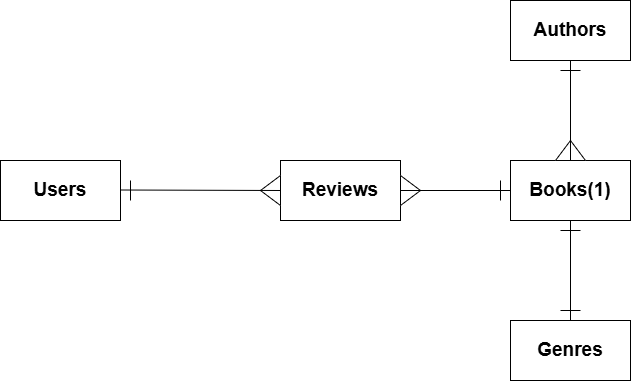

# Design Document

By Stanislav Kuchmuk

Video overview: <https://youtu.be/2SCQTjt7thY>

## Scope

The purpose of the database is to support a book review platform that allows users to track books they’ve read, rate and review them, and read reviews from others.

Included items in Scope:
* Users: including basic identifying information.
* Books: including title, author, publication info, and ISBN.
* Reviews: including a rating, textual review, and timestamp.
* Authors: including full names and birth years.
* Genres: so users can browse or filter books by category.

Out of Scope Items:
* Book advertisements, It's content, Features likes likes or subscribing to an author.

## Functional Requirements

Users Should Be Able To:
* Register a profile.
* Search for books by title, author, or genre.
* Submit a rating and review for a book.
* See all reviews for a particular book or by a particular user.
* Browse top-rated books in a specific genre or by a specific author.

Users Will Not Be Able To:
* Upload their own content
* Reply the reviews

## Representation
Entities are captured in SQLite tables with the following schema:

### Entities

# Users
id INTEGER, PRIMARY KEY
username TEXT, UNIQUE, NOT NULL
password TEXT, NOT NULL
`Reasoning: unique username is requiered so that 22 people won't have the account under the same username. Id could be used to track which account was created first, second, etc.`

# Authors
id INTEGER, PRIMARY KEY
full_name TEXT,
birth_year INTEGER
`Reasoning: no UNIQUE identifier allows us to support multiple authors with shared names.`

# Genres
id INTEGER, PRIMARY KEY
name TEXT, UNIQUE, NOT NULL
`Reasoning: Genre names are textual and must be unique. Is not ENUM in the genre name since more genres can possibly be created.`

# Books
id INTEGER, PRIMARY KEY
title TEXT, NOT NULL
author_id INTEGER, FOREIGN KEY to Authors
genre_id INTEGER, FOREIGN KEY to Genres
isbn TEXT, UNIQUE, NOT NULL
published_year INTEGER
`Reasoning: title is not unique since multiple books might have the same title. books are as well connected with genre and author tables for easier sorting/filtering. ISBN is globally unique and a good indexing key. Year is stored as an integer for sorting/filtering.`

# Reviews
id INTEGER, PRIMARY KEY
user_id INTEGER, FOREIGN KEY to Users
book_id INTEGER, FOREIGN KEY to Books
rating FLOAT, CHECK rating BETWEEN 1 AND 10, NOT NULL
review_text TEXT
timestamp CURRENT_TIMESTAMP
`Reasoning: The rating uses a constraint to enforce valid input between 1 and 10. timestamp enables sorting by review recency.`

### Relationships

The below entity relationship diagram describes the relationships among the entities in the database.

## Optimizations

* Indexes on genres.name, books.published_year, books.title, and authors.full_name to support fast search.
* Views for “Top Rated Books by Genre” and “User Review History” to simplify common queries.
* Foreign keys between reviews and books/users.

## Limitations

* Without joining tables, we are currently limited to 1 genre and author per book
* Database might not represent the average rating very well, since tables are not joined
